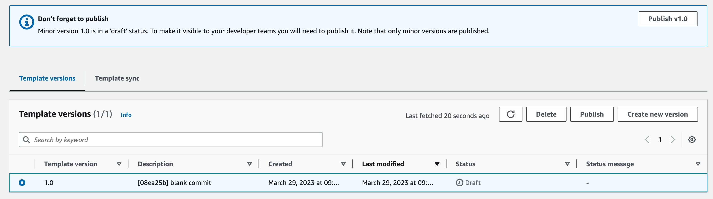
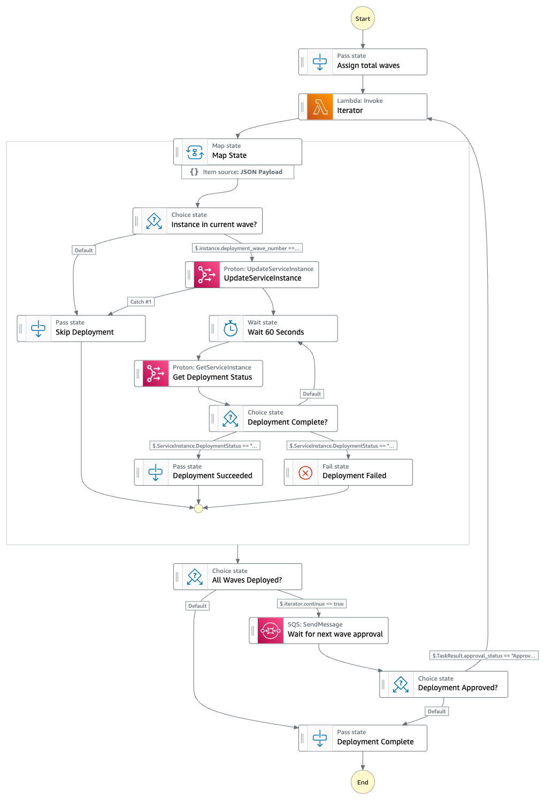
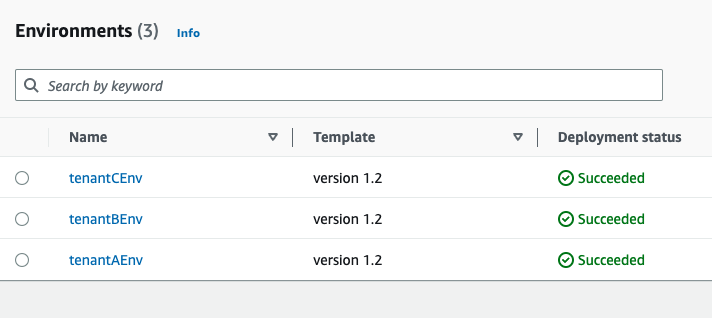

# Automating SaaS tenant provisioning and deployments with AWS Proton and AWS Step Functions

Software-as-a-Service (SaaS) based delivery models set a higher standard for operational excellence. Automation is the key to success for repetitive tasks like onboarding a new customer (tenant), or deploying releases inside your SaaS environment.

DevOps practices become more challenging when SaaS providers choose to mix [Silo and Pool](https://docs.aws.amazon.com/wellarchitected/latest/saas-lens/core-isolation-concepts.html) deployment models, where certain tenants are provisioned dedicated resources and certain tenants share resources. As detailed in the [SaaS Tenant Isolation strategy whitepaper](https://aws.amazon.com/blogs/apn/explore-saas-tenant-isolation-strategies-in-new-saas-whitepaper/), these choices depend on various factors, such as tiering, SLAs, account limits, blast radius, compliance, regional considerations, etc. 

This repository shows how you can leverage [AWS Proton](https://docs.aws.amazon.com/proton/) for this use case. With AWS Proton, platform teams inside SaaS organizations can create infrastructure [templates](https://docs.aws.amazon.com/proton/latest/userguide/ag-templates.html) that can be leveraged to provision new tenant environments and keep these environments up to date by automating code deployments using [service pipelines](https://docs.aws.amazon.com/proton/latest/userguide/ag-services.html). The product teams can focus on the development of SaaS microservices.

This allows SaaS developers and DevOps engineers to automate the provisioning and deployment using standard tooling, instead of creating their own bespoke manual processes.

> Note: If you are not familiar with AWS Proton, then we recommended that you get familiar with Proton concepts by running the [AWS Proton workshop](https://catalog.workshops.aws/proton/en-US) inside your AWS account. Module 0 and Module 1 should give you the basic understanding of the service.


## What use cases does this solution address?

### 1. Silo or Hybrid SaaS deployments, with support of tier based customization
You can leverage this solution to provision tenant environments by creating parameterized infrastructure as a code (IaC) templates. These parameters(properties) could be attributes like Task Size, Desired Task Count, etc. that can help you meet SLAs across different tenants or tiers.

This solution allows you to deploy your SaaS microservices inside these tenant environments, as part of tenant provisioning process. Further, this solution provides an approach to update these tenant environments, with the latest build, using a CI/CD based approach (service pipelines).

Figure 1 represents a tenant provisioning process that takes care of provisioning tenant infrastructure and the service pipelines make sure that all tenants are kept in sync with the latest build of SaaS microservices. Also, note the tier based customization benefit that comes with this approach.

> Note: The SaaS application plane could be a single AWS Account or multiple AWS accounts. This solution provides an **in-built** support to deploy your SaaS application across multiple AWS Accounts.

<p align="center">
    
    <br>
    Figure 1: Silo or Hybrid SaaS deployments, with support of tier based customization
</p>

### 2. Support Canary deployments ([staggered deployments](https://aws.amazon.com/builders-library/automating-safe-hands-off-deployments/#Production_deployments)) across tenants 
At times, SaaS providers tend to release new features to a subset of tenants\tiers and monitor the impact of those features before rolling out to other tenants or tiers. This solution provides flexibility to deploy new releases in "waves". You can assign wave numbers to tenants\tiers and follow an approval process to roll out changes by wave numbers. 

<p align="center">
    
    <br>
    Figure 2: Canary Deployments across Tenants or Tiers
</p>

## Solution Overview

Below is the high level representation of the solution that leverages AWS Proton to solve these use cases. You will see this in action when you deploy this solution in the following section.

<p align="center">
    
    <br>
    Figure 3: Solution Overview
</p>

1. This solution supports the creation of a parameterized “Tenant Environment Template” that you can leverage to provision tenants/tiers. In our case, the environment template will deploy a VPC and an empty ECS cluster.
2. Parameterized “Service Template” offers to deploy an ECS service, inside the ECS cluster, created as part of the environment, using the container image property supplied at the runtime. This means you can leverage a single Service Template to deploy multiple containerised services inside tenant environments. 
3. This solution also creates a service pipeline for each microservice and takes care of deploying the service across all tenants, moving forward. In our case we only have one containerized service and one serverless service. 
4. Tenant provisioning process will:
    - 4a) Leverage the Tenant Environment Template to deploy a Tenant\Tier Environment. It supplies VPC cidr block and other properties for setting up ECS Cluster (EC2 container insights, enable EC2 capacity etc.). This approach allows you to configure tenant environments based upon your tiering needs.
    - 4b) Leverage the Service Template to deploy the SaaS application microservice(s) inside the tenant environment by creating “Service instances”. It supports properties such as task size, task count, etc., to configure ECS service based upon your tenant tiers.
5. You can optionally onboard more tenants\tiers into the system that will reuse the parameterized templates to create tenant environments and deploy service instances inside those environments. 
6. When a developer commits code or when you run the service pipeline manually, the service pipeline will build the container image based on the service Dockerfile.
7. Service pipeline will then leverage Proton and AWS Step Functions to update all tenants\tiers service instances in “waves”, with an in-built approval process. 

## Deploying the solution

The three main components of this solution are:

- **AWS Proton**: Used for templates creation, creating tenant environments, creating service pipelines.
- **AWS CDK**: The IaC is writtent using CDK, which Proton leverages to create and deploy infrastrucure.
- **AWS CodePipeline with AWS Step Functions integration**: AWS CodePipeline leverages step function integration to deploy tenants\tiers in waves, with an in-built approval step.


### Step 1. Prerequisites
- [Install jq](https://stedolan.github.io/jq/download/)
- Make sure you have the latest version of [AWS CLI](https://docs.aws.amazon.com/cli/latest/userguide/getting-started-install.html)

### Step 2. Fork and clone the repository
Please fork this repository and name the forked repository as **"multi-tenant-proton"**, as the following cli commands assumes this as the name of the repository. By creating a fork you will be able to make code commits to the SaaS application and see how those changes are deployed across multiple tenants, as part of deployment. 

Once forked, please clone the repository inside your development environment.

The following steps assume you are in the root folder of the repository. Use below command to change to the correct working directory.

```
cd multi-tenant-proton
```

### Step 3. Create Connection to your GitHub repository
In order for AWS Proton to connect to your GitHub repository, you need to create a new connection using [Developer Tool Console](https://console.aws.amazon.com/codesuite/settings/connections). Follow [these steps](https://docs.aws.amazon.com/dtconsole/latest/userguide/connections-create-github.html) to connect the newly forked GitHub repository. Name the connection as **"multi-tenant-proton"**.

### Step 4. Create a link to your repository inside AWS Proton
Now let's use the connection created above to create the repository reference inside AWS Proton. The commands below assume that you forked\created the repository by the name of **"multi-tenant-proton"**.

First, set the ConnectionArn that was created in the prior step.

```
CONNECTIONARN=$(aws codestar-connections list-connections | jq '.Connections[] | select(.ConnectionName=="multi-tenant-proton")' | jq -r '.ConnectionArn')
```

Second, create the Proton repository. Replace the GITHUBUSERNAME with your GitHub user.
```
REPOSITORY=$(aws proton create-repository --connection-arn $CONNECTIONARN --name <<GITHUBUSERNAME>>/multi-tenant-proton --provider GITHUB | jq -r '.repository')
REPOSITORY_NAME=$(echo $REPOSITORY | jq -r '.name')
REPOSITORY_ARN=$(echo $REPOSITORY | jq -r '.arn')
echo $REPOSITORY_NAME
echo $REPOSITORY_ARN
```

You can view this repository by navigating to the AWS Proton console and selecting Settings -> Repositories from the left navigation.

### Step 5. Create Proton Provisioning roles
We are using [CodeBuild Provisioning](https://aws.amazon.com/blogs/containers/announcing-aws-cdk-support-and-codebuild-provisioning-for-aws-proton/) within AWS Proton that leverages AWS CDK to provision the tenant environment. We need to create a role that Proton can leverage to provision the infrastructure. 

```
PROTON_PROVISIONING_POLICY_ARN=$(aws iam create-policy \
--policy-name proton-provisioning-policy \
--policy-document file://files/proton-provisioning-policy.json | jq -r '.Policy.Arn')

PROTON_PROVISIONING_ROLE_ARN=$(aws iam create-role \
--role-name proton-provisioning-role \
--assume-role-policy-document '{"Version":"2012-10-17","Statement":[{"Effect":"Allow","Principal":{"Service":"codebuild.amazonaws.com"},"Action":"sts:AssumeRole"}]}' | jq -r '.Role.Arn')
aws iam attach-role-policy --role-name proton-provisioning-role  --policy-arn $PROTON_PROVISIONING_POLICY_ARN
```

Update the Proton account settings with the role information.

```
aws proton update-account-settings --pipeline-codebuild-role-arn $PROTON_PROVISIONING_ROLE_ARN \
--pipeline-service-role-arn $PROTON_PROVISIONING_ROLE_ARN
```

### Step 6. Create tenant environment template inside AWS Proton

> This step corresponds to point 1 of the [“Solution Overview“](#solution-overview) section above.

We have used AWS CDK to define the environment template. You can refer to the "tenant-env-template/v1/infrastructure" folder for the template definition. In our case, the environment template defines the following infrastructure for the tenant:

- A VPC with 2 public subnets and 2 private subnets
- A NAT Gateway and Internet Gateway
- An empty ECS cluster inside the VPC 
- An empty S3 bucket

This environment template accepts few properties, such as tenantId, vpc_cidr_block, ec2_instance_type etc. Refer the "tenant-env-template/v1/schema" directory for the full list of all the properties. The idea here is to provide these properties when you create tenant environments in the next step.

Run the below command to create the template. Please keep in mind that the commands below only define the template inside Proton and do **NOT** provision anything at this point.

```
aws proton create-environment-template --name tenant-env-template
```

Now run the command below to associate the environment template with the repository created in the previous step.

```
aws proton create-template-sync-config --branch main \
--repository-name $REPOSITORY_NAME --repository-provider GITHUB \
--template-name tenant-env-template \
--template-type ENVIRONMENT --subdirectory /tenant-env-template
```

Navigate to AWS Proton console and select Templates → Environment Templates from the left navigation. Then select the template "tenant-env-template". You will notice an unpublished template version as shown in Figure 4. Publish the draft version 1 by either clicking on **"Publish v1.0"** button or by selecting the template version and clicking on the publish button.

> Note: If you don't see the draft version, then try to push a dummy commit by creating a dummy file inside the "tenant-env-template/v1/" folder.

<p align="center">
    
    <br>
    Figure 4: Publish Environment Template Version
</p>


Please note that the Proton Template sync configurations keep track of the changes to the template in the repository at the specified location (/tenant-env-template). Whenever a commit is pushed to the repository that changes one of the template bundles, a new minor or major version of the template is created. We won't be discussing the template version upgrades in this solution. If you are interested, you can refer the proton documentation for [template versions](https://docs.aws.amazon.com/proton/latest/userguide/ag-template-versions.html), [template sync configurations](https://docs.aws.amazon.com/proton/latest/userguide/ag-template-sync-configs.html) and [updating an environment](https://docs.aws.amazon.com/proton/latest/userguide/ag-env-update.html).


### Step 7. Create the service template for the SaaS application
> This step corresponds to point 2 of the [“Solution Overview“](#solution-overview) section above.

We will now create the service template that defines the IaC for our SaaS microservice and it's deployment pipeline. The definition of this service template is located inside "service-templates\ecs-fargate-service\v1\instance_infrastructure" folder.

Look at the "ECSFargateSvcInputs" section inside "service-templates/ecs-fargate-service/v1/schema/schema.yaml" for the properties that this template supports. For example, you can supply task_size which can help you set the cpu/memory configurations for an ECS Task. This way we can completely abstract the implementation details from the developer and just provide the t-shirt size options to them (x-small, small, etc). The template also accepts the container image as a property which can be passed for ECS Task definition. Please note that the container image will be updated dynamically with the help of pipeline automation (discussed later).

Ignore the "PipelineInputs" section inside "schema.yaml" for now as we will discuss the pipelines later. 

Run the below command to create a service template.
```
aws proton create-service-template \
--name ecs-fargate-service
```

Now run the below command to associate the service template with your repository that store the template definition.
```
aws proton create-template-sync-config \
--branch main --repository-name $REPOSITORY_NAME --repository-provider GITHUB \
--template-name ecs-fargate-service --template-type SERVICE \
--subdirectory /service-templates/ecs-fargate-service
```

Similar to what you did for the environment template in Step 6, navigate to AWS Proton console and select Templates → Service Templates from the left navigation. Then select the newly created service template "ecs-fargate-service" and publish the draft version 1 by either clicking on **"Publish v1.0"** button or by selecting the template version and clicking on the publish button.

### Step 8. Create the service definition and service pipeline
> This step corresponds to point 3 of the [“Solution Overview“](#solution-overview) section above.

We will now create a new [Proton Service](https://docs.aws.amazon.com/proton/latest/userguide/ag-services.html) inside AWS Proton that will create the CI/CD pipeline, as defined inside "service-templates\ecs-fargate-service\v1\pipeline_infrastructure" folder.

We are using "files/saas-app-spec.yaml" as our spec file. If you notice the "buildspecfile" property is pointing to the location of Dockerfile inside "containerized-saas-application" folder. This is how our pipeline knows what to build.

```
aws proton create-service \
    --name "containerized-saas-app" \
    --template-name "ecs-fargate-service" \
    --template-major-version "1" \
    --branch-name "main" \
    --repository-connection-arn $CONNECTIONARN \
    --repository-id $REPOSITORY_NAME \
    --spec file://files/saas-app-spec.yaml    
```

Navigate to Proton console and click on "Services" from left navigation menu. Monitor the deployment of service and make sure it completes. You should see "Service status" as "Active" and "Pipeline provisioning status" as "Succeeded". 

This will also provision "containerized-saas-app-pipeline" CodePipeline. After the deployment, this Pipeline will execute and build the container image and push to ECR. You can navigate to ECR console and look at the container image built by this pipeline.

### Step 9. Tenant provisioning

#### Step 9a. Create tenant environment
> This step corresponds to point 4a of the [“Solution Overview“](#solution-overview) section above.

We will now use this template to provision new tenants within the system, as part of tenant provisioning process.

Let's now create the tenant environment by using the template created in the previous step. Note how we are passing the properties to this environment which eventually are passed to our CDK Application as part of the deployment. You can provide unique properties depending upon the tenant\tier you are onboarding. For example, the tenant creation command below will not enable container insights by setting enhanced_cluster_monitoring as false.

```
aws proton create-environment --codebuild-role-arn $PROTON_PROVISIONING_ROLE_ARN \
--name tenantAEnv --template-name tenant-env-template \
--template-major-version 1 --template-minor-version 0 \
--spec '{proton: EnvironmentSpec, spec: {tenantId: tenantA, vpc_cidr_block: 10.0.0.0/16, ec2_capacity: false, ec2_instance_type: t3.medium, allow_ecs_exec: false, enhanced_cluster_monitoring: false, service_discovery_namespace: t1.saasapplication.com}}'
```

Navigate to Proton console and select "Environments" from left navigation menu. You will see the new environment being provisioned. In a few minutes, you will also see the underlying CloudFormation stack being provisioned in the CloudFormation console. Wait for a few minutes to let the Proton finish deploying the environment.

#### Step 9b. Deploying the SaaS Application inside the tenant environment
> This step corresponds to point 4b of the [“Solution Overview“](#solution-overview) section above.

We will now deploy the dockerized SaaS application located in the "containerized-saas-application" folder into the tenantAEnv using the service template. We will call this "service instance" as "tenantA-saas-app".

First, open the "file://tenantA-saas-app-spec.yaml" and modify the "image" property with the ECR repository URI. You can get this from the ECR console. It should be in a format like "xxxxxxxxxxxx.dkr.ecr.regionid.amazonaws.com/<<service_name>>:1", with account and region id specific to your case. This was built as part of Step 8, when we deployed our pipeline. Make sure to include the tag in the URI.

Now, run the below command to create the service instance.

```
aws proton create-service-instance \
--name "tenantA-saas-app" \
--service-name "containerized-saas-app" \
--spec file://files/tenantA-saas-app-spec.yaml
```

This will kick off service instance creation. Wait for the service instance deployment to complete.

#### Step 9c. Validating the deployment
At this stage, the tenant environment is provisioned and the containerized SaaS service is deployed inside this environment. You can view the deployed application by using the provisioned load balancer DNS name, which will be available inside the EC2 --> Load balancers AWS console page. 

### Step 10. (Optional) Provision more tenants
> This step corresponds to point 5 of the [“Solution Overview“](#solution-overview) section above.

You can onboard more tenants, if you want, by simpling running the "aws proton create-environment" cli command as mentioned in the previous step. 

For example, you can run the command below to provision tenantB environment.

```
aws proton create-environment --codebuild-role-arn $PROTON_PROVISIONING_ROLE_ARN \
--name tenantBEnv --template-name tenant-env-template \
--template-major-version 1 --template-minor-version 0 \
--spec '{proton: EnvironmentSpec, spec: {tenantId: tenantB, vpc_cidr_block: 10.0.0.0/16, ec2_capacity: false, ec2_instance_type: t3.medium, allow_ecs_exec: false, enhanced_cluster_monitoring: false, service_discovery_namespace: t2.saasappliction.com}}'
```

As before, open the "file://tenantB-saas-app-spec.yaml" and modify the "image" property with the ECR repository URI. You can get this from the ECR console. It should be in a format like "xxxxxxxxxxxx.dkr.ecr.regionid.amazonaws.com/<<service_name>>:1", with account and region id specific to your case. This was built as part of Step 8, when we deployed our pipeline. Make sure to include the tag in the URI.

Use the command below to deploy service instance inside tenantBEnv. 

```
aws proton create-service-instance \
--name "tenantB-saas-app" \
--service-name "containerized-saas-app" \
--spec file://files/tenantB-saas-app-spec.yaml
```

### Step 11. Understanding the CI/CD pipeline
> This step corresponds to point 6 and 7 of the [“Solution Overview“](#solution-overview) section above)

If you can recall, one of our use case was to enable deployments of tenants in waves. To accomplish that, we will add a "deployment_wave_number" tag to our service instances. Our pipeline will deploy the service instance in waves using this tag. You can anytime update the service instance tags and change the order of deployment.

We will initially deploy all the service instances in single wave and expirement more with wave numbers in a later section.

Add the tag to "tenantA-saas-app" service instance.

```
SERVICEINSTANCEARN=$(aws proton get-service-instance \
--name "tenantA-saas-app" \
--service-name "containerized-saas-app" | jq -r '.serviceInstance.arn')
aws proton tag-resource --resource-arn $SERVICEINSTANCEARN \
--tags key=deployment_wave_number,value=1
```

If you created tenantB-saas-app service instance in the previous step, then please add the tag for that instance as well.

```
SERVICEINSTANCEARN=$(aws proton get-service-instance \
--name "tenantB-saas-app" \
--service-name "containerized-saas-app" | jq -r '.serviceInstance.arn')
aws proton tag-resource --resource-arn $SERVICEINSTANCEARN \
--tags key=deployment_wave_number,value=1
```

Now select the "containerized-saas-app-pipeline" and press "Release Change" button to start the deployment process. You should see the Pipeline finish in few minutes. During the Pipeline execution, once the Pipeline goes is in "InvokeStepFunctions", navigate to "Proton" -> "Service Instances". You should see Deployment Status of "tenantA-saas-app" (and "tenantB-saas-app") as "In progress".

Let's understand this CodePipeline step by step to see what is going on.

1. The Source step is monitoring our source code repository for any changes.
2. The Build step is where the SaaS application container image is being built. If you open the "files/tenantA-saas-app-spec.yaml" you will notice two pipeline properties - 1) buildspecfile and 2) dockerfile. The buildspecfile property points to the buildspec file located inside our SaaS application, which is "containerized-saas-application". This buildspec builds the image and pushes to ECR. It then updates the spec of service_instance with the path to the ECR repository and generates the final yaml file for the next deployment step.
3. The most interesting part of this pipeline is the deployment step, which is a step function. This step function accepts the file generated by the build step as input and updates all the service instances for all tenants with the new container image.

Figure 6 shows the step function definition.

<p align="center">
    
    <br>
    Figure 6: Step Function Graph
</p>

Here is the high level explanation of this step function:

1. "Assign total waves" step assigns the total number of waves we want to configure for tenant deployments. This parameter is available as an input to the service pipeline. To begin with, totalwaves is set to 1 as part of pipeline creation. This means we expect all tenants\tiers to be deployed at once.
2. The idea of "Iterartor" is to loop based upon number of totalwaves.
3. The "Map state" looks at all the instances that are in the current wave and deploys them using the latest spec and by invoking "UpdateServiceInstance", leveraging the SDK Integration of step function. The current wave is determined using the "deployment_wave_number" tag of the service instance that we associated before. This gives us flexibility to change deployment waves as needed.
4. If we have configured more than one wave, the step function sends a message to SQS with the “TaskToken” and waits for approval.
5. The product teams can monitor the tenant deployments that happened in wave 1, using observability tools of their choice. They can then use "SendTaskSuccess" API to approve the next wave using the below command. You would need to grab the TaskToken from the SQS queue in this case.

```
aws stepfunctions send-task-success --task-token <<TaskToken>> --task-output "{\"approval_status\": \"Approved\"}"
```

### Step 12: Update the SaaS application
Now, since we have set up the entire solution, you can make changes to the "containerized-saas-application" and see the changes being deployed in all service instances by the CI/CD pipeline.

In order to do this, make any slight modification to the "index.html" file inside "containerized-saas-application" and push the commit. Once committed, the pipeline will trigger, build the latest image and deploy across all tenant environments.

### (Optional) Step 13: Experiment with Deployment waves

In order to see deployment waves in action, you will need to follow the below steps.

1. Update the desired wave count in the pipeline inputs. You can run the below command to update it to 2. This means tenants will be deployed in two waves. The "saas-app-spec-pipeline.yaml" file has the

```
aws proton update-service-pipeline --deployment-type CURRENT_VERSION \
--service-name "containerized-saas-app" \
--spec file://files/saas-app-spec-pipeline.yaml
```

2. Update the "deployment_wave_number" tags of the desired service instance to reflect which service_instance (tenant) you want to deploy in wave 2. For example, you can update it to 2 for "tenantB-saas-app" instance using the below command.
```
SERVICEINSTANCEARN=$(aws proton get-service-instance \
--name "tenantB-saas-app" --service-name "containerized-saas-app" | jq -r '.serviceInstance.arn')
aws proton tag-resource --resource-arn $SERVICEINSTANCEARN --tags key=deployment_wave_number,value=2
```
3. Run the CodePipeline "containerized-saas-app-pipeline" and wait for the pipeline to start executing the StepFunction.
4. Open the latest running StepFunction execution and wait for Wave 1 to complete.
5. Let the "wait for next wave approval task" to complete. This task will send a message to "containerized-saas-app-pipeline-ApprovalQueue" inside SQS.
6. Read the message in the queue and note the TaskToken sent by StepFunction inside the message.
7. Approve the next deployment by executing below command with the correct task token.
```
aws stepfunctions send-task-success \
--task-token <<TaskToken> \
--task-output "{\"approval_status\": \"Approved\"}"
```

8. Go back to step function and see the step function proceeding and deploying the next wave of tenants.

### (Optional) Step 14: Creating Cross Account Tenant Environments
A nice thing about AWS Proton is that it lets you create environment account connections. This means that you can now deploy your environments to other AWS Accounts and Proton can manage that for you seamlessly.

As an optional exercise, you can follow the [AWS documentation](https://docs.aws.amazon.com/proton/latest/userguide/ag-env-account-connections.html) and [this blog](https://aws.amazon.com/blogs/architecture/simplifying-multi-account-ci-cd-deployments-using-aws-proton/) to create a environment connection and create tenantC environment using the created environment connection.

Here are the high level steps you need to follow.
1. Login into the AWS Account where you want to create tenant or tier environment.
2. Create the Proton provisioning role in this account, similar to "Step 5" above. You can leverage the same command to do so.
3. Inside the AWS Proton console, navigate to "Environment account connections" from left navigation.
4. Send a "Request to connect" to your management\control plane account. Make sure to provide the "CodeBuild provisioning role", you created in point 2.
5. Log back into the management\control plane account and "Accept" the connection request from the "Environment account connections" page.
6. Next, give linked account access to the ECR repository that our CI/CD pipeline has pushed the image to ("saas-app-repo"). You need to edit the permissions of this ECR repo and replace the Policy JSON as shown below. Make sure to update with the correct account id.

```
{
  "Version": "2012-10-17",
  "Statement": [
    {
      "Sid": "AllowPushPull",
      "Effect": "Allow",
      "Principal": {
        "AWS": "arn:aws:iam::ACCOUNT-ID:root"
      },
      "Action": [
        "ecr:BatchGetImage",
        "ecr:GetAuthorizationToken",
        "ecr:GetDownloadUrlForLayer"
      ]
    }
  ]
}
```
7. Create the tenantC environment by using the account connection. Make sure to replace the correct connection id from "Environment account connections" page.

```
aws proton create-environment \
--environment-account-connection-id a985f472-f452-4115-abed-82e2c4b9a2be \
--name tenantCEnv --template-name tenant-env-template \
--template-major-version 1 --template-minor-version 0 \
--spec '{proton: EnvironmentSpec, spec: {tenantId: tenantC, vpc_cidr_block: 10.0.0.0/16, ec2_capacity: false, ec2_instance_type: t3.medium, allow_ecs_exec: false, enhanced_cluster_monitoring: false, service_discovery_namespace: t3.saasappliction.com}}'
```

7. You can now deploy the service inside this environment as usual.

```
aws proton create-service-instance \
--name "tenantC-saas-app" \
--service-name "containerized-saas-app" \
--spec file://files/tenantC-saas-app-spec.yaml

SERVICEINSTANCEARN=$(aws proton get-service-instance --name "tenantC-saas-app" --service-name "containerized-saas-app" | jq -r '.serviceInstance.arn')
aws proton tag-resource --resource-arn $SERVICEINSTANCEARN --tags key=deployment_wave_number,value=1
```

Please be sure to run the CodePipeline to deploy the Dockerimage any time after you create a service instance.

As shown in Figure 7, the Proton management account (SaaS Control plane) will list all the environments, but the actual infrastructure is provisioned in the connected account.

<p align="center">
    
    <br>
    Figure 7: All tenant environments listed in the management account/control plane
</p>

### (Optional) Step 15: Deploying a Serverless Application
So far, we have deployed a containerized application inside our environments. This solution also come with a serverless template located inside "service-templates/serverless-service" folder. This template creates an API Gateway and deploys the lambda function located inside "serverless-saas-application" folder. Follow the steps below to deploy the service instance inside tenantAEnv and the service pipeline.

We will leverage the same environments to provision this service. So we just need to create service templates, service infrastructure and service pipeline.

1. Create the service template for our serverless service. Run the command below to create the service template.
```
aws proton create-service-template --name serverless-service
```
2. Now run the command below to associate the service template with your repository that stores the template definition.
```
aws proton create-template-sync-config \
--branch main --repository-name $REPOSITORY_NAME \
--repository-provider GITHUB --template-name serverless-service \
--template-type SERVICE --subdirectory /service-templates/serverless-service
```
3. Publish version 1.0 of the service template from the Proton console, by navigating to the service template.
4. We need to zip up the lambda functions and upload to the tenantAEnv Bucket. This is a one-time activity required for each tenant and only required as part of service instance creation. Moving forward, this will be handled by the CI/CD pipeline, which builds the archive file for the lambda function and deploys inside the tenant service instances. 

```
BUCKET_NAME=$(aws cloudformation list-exports \
--query "Exports[?Name=='BucketName-tenantAEnv'].Value" \
--output text)
cd serverless-saas-application/lambda_functions/
ZIPFILENAME=lambda_functions.zip
zip $ZIPFILENAME *
aws s3 cp $ZIPFILENAME s3://$BUCKET_NAME
rm $ZIPFILENAME
cd ../../
```
5. Create the service and tenantA service instance using the newly created service template and spec file. 
```
aws proton create-service \
    --name "serverless-saas-app" \
    --template-name "serverless-service" \
    --template-major-version "1" \
    --branch-name "main" \
    --repository-connection-arn $CONNECTIONARN \
    --repository-id $REPOSITORY_NAME \
    --spec file://files/tenantA-serverless-saas-app-spec.yaml    
```
6. Wait for the service creation to complete.
7. Add the deployment_wave_number tag to the newly created service instance
```
SERVICEINSTANCEARN=$(aws proton get-service-instance \
--name "tenantA-serverless-saas-app" \
--service-name "serverless-saas-app" | jq -r '.serviceInstance.arn')
aws proton tag-resource --resource-arn $SERVICEINSTANCEARN \
--tags key=deployment_wave_number,value=1
```
8. Let's add another service instance with deployment_wave_number as 2.
As before, zip up the lambda functions and upload to the tenantBEnv Bucket.
```
BUCKET_NAME=$(aws cloudformation list-exports \
--query "Exports[?Name=='BucketName-tenantBEnv'].Value" --output text)
cd serverless-saas-application/lambda_functions/
ZIPFILENAME=lambda_functions.zip
zip $ZIPFILENAME *
aws s3 cp $ZIPFILENAME s3://$BUCKET_NAME
rm $ZIPFILENAME
cd ../../
```

9. Now create the service instance and add the tag.
```
aws proton create-service-instance \
--name "tenantB-serverless-saas-app" \
--service-name "serverless-saas-app" \
--spec file://files/tenantB-serverless-saas-app-spec.yaml
```
```
SERVICEINSTANCEARN=$(aws proton get-service-instance \
--name "tenantB-serverless-saas-app" \
--service-name "serverless-saas-app" | jq -r '.serviceInstance.arn')
aws proton tag-resource --resource-arn $SERVICEINSTANCEARN \
--tags key=deployment_wave_number,value=2
```
10. Navigate to API Gateway console and you will see "tenantA- service" and "tenantB- service". Feel free to browse the API Gateway endpoints.
11. Make any code changes to the "serverless-saas-application\lambda_functions\hello-world.js" Lambda Function and push the code to the repository.
12. Navigate to CodePipeline console and you will see that pipeline will execute and deploy the changes to tenant environments. The step function in this case is configured with "total_waves=2", and it will wait for you to approve the next wave. 
13. Navigate to SQS console and retrieve the StepFunction task token from the message inside "serverless-saas-app-pipeline-ApprovalQueue". You can approve the next wave using below command and passing the task token.
```
aws stepfunctions send-task-success --task-token <<TaskToken>> --task-output "{\"approval_status\": \"Approved\"}"
```

## Cleanup steps
Cleanup steps will depend on whether you performed optional steps or not. So you may need to only execute some of the cli commands from below.

1. Delete Serverless SaaS App service and its service instances. Make sure you don't have any executions of StepFunction in "Running" state.
```
aws proton delete-service --name serverless-saas-app
```

2. Delete Containerized SaaS App service and its service instances. Make sure you don't have any executions of StepFunction in "Running" state.
```
aws proton delete-service --name containerized-saas-app
```

3. Delete the service pipelines
```
aws cloudformation delete-stack --stack-name serverless-saas-app-pipeline 
aws cloudformation delete-stack --stack-name containerized-saas-app-pipeline
```
4. To delete environments, first empty the s3 buckets and then delete the environments.

```
TENANT_A_BUCKET=$(aws cloudformation list-exports --query "Exports[?Name=='BucketName-tenantAEnv'].Value" --output text)
TENANT_B_BUCKET=$(aws cloudformation list-exports --query "Exports[?Name=='BucketName-tenantBEnv'].Value" --output text)
aws s3api delete-object --bucket $TENANT_A_BUCKET --key lambda_functions.zip
aws s3api delete-object --bucket $TENANT_B_BUCKET --key lambda_functions.zip
```

```
aws proton delete-environment --name tenantCEnv
aws proton delete-environment --name tenantBEnv
aws proton delete-environment --name tenantAEnv
```

4. Run below command to delete environment templates. You might need to delete more minor versions if you made changes to template.
```
aws proton delete-environment-template-version --major-version 1 --minor-version 0 --template-name tenant-env-template
aws proton delete-environment-template --name tenant-env-template
```

5. Run below command to delete service templates.  You might need to delete more minor versions if you made changes to template.
```
aws proton delete-service-template-version --major-version 1 --minor-version 0 --template-name ecs-fargate-service
aws proton delete-service-template --name ecs-fargate-service
```

```
aws proton delete-service-template-version --major-version 1 --minor-version 0 --template-name serverless-service
aws proton delete-service-template --name serverless-service
```

6. Delete the environment connection, if you created one. 

7. Run the below command in the account from where you requested to connect. The "--requested-by" should be "ENVIRONMENT_ACCOUNT" id you requested to connect from your tenant environment account, or it should be "MANAGEMENT_ACCOUNT" if you requested to connect from management account/control plane.

```
CONNECTION_ID=$(aws proton list-environment-account-connections --requested-by ENVIRONMENT_ACCOUNT | jq -r '.environmentAccountConnections[0].id')  
aws proton delete-environment-account-connection --id $CONNECTION_ID 
```

8. Delete template sync configurations
```
aws proton delete-template-sync-config --template-name tenant-env-template --template-type ENVIRONMENT                 

aws proton delete-template-sync-config --template-name ecs-fargate-service --template-type SERVICE

aws proton delete-template-sync-config --template-name serverless-service --template-type SERVICE
```

9. Delete the Proton Repository.
```
aws proton delete-repository --name <<GITHUBUSERNAME>>/multi-tenant-proton --provider GITHUB 
```

10. Delete the Proton provisioning policy and role.
```
POLICY_ARN=$(aws iam list-policies | jq -r '.Policies[] | select(.PolicyName=="proton-provisioning-policy")'.Arn)
aws iam detach-role-policy --role-name proton-provisioning-role --policy-arn $POLICY_ARN
aws iam delete-policy --policy-arn $POLICY_ARN
aws iam delete-role --role-name proton-provisioning-role 
```


## Security

See [CONTRIBUTING](CONTRIBUTING.md#security-issue-notifications) for more information.

## License

This library is licensed under the MIT-0 License. See the LICENSE file.

